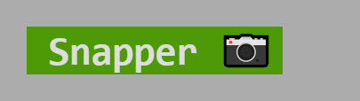

# Snapper 📷
[](https://github.com/littletof/snapper)


> Snapper allows you to generate images from ANSI formatted text.

> 🚧 Project is WIP, expect breaking changes

Generate this image:


With this:
```ts
import { snap } from "https://deno.land/x/snapper/mod.ts";

const testText = `bold            dim             italic          underline       inverse         strikethrough    
black           red             green           yellow          blue            magenta         cyan            white         
gray            redBright       greenBright     yellowBright    blueBright      magentaBright   cyanBright      whiteBright  
bgBlack         bgRed           bgGreen         bgYellow        bgBlue          bgMagenta       bgCyan          bgWhite       
bgBlackBright   bgRedBright     bgGreenBright   bgYellowBright  bgBlueBright    bgMagentaBright bgCyanBright    bgWhiteBright `;

await snap([
    {content: testText, imageSavePath: 'docs/images/all.png', viewport: {width: 1045}},
]);
```

# Usage

#### Set up puppeteer
> In the background the module uses [deno Puppeteer](https://deno.land/x/puppeteer@9.0.2), which is a fork of [Puppeteer](https://github.com/puppeteer/puppeteer).

Follow the [current setup steps](https://github.com/lucacasonato/deno-puppeteer#installation), the basic setups should be something like:

```bash
PUPPETEER_PRODUCT=chrome deno run -A --unstable https://deno.land/x/puppeteer@9.0.2/install.ts

#windows
$env:PUPPETEER_PRODUCT='chrome'; deno run -A --unstable https://deno.land/x/puppeteer@9.0.2/install.ts
```

## Generate images
After puppeteer was set up, simply run the following:

```ts
import { snap } from "https://deno.land/x/snapper/mod.ts";

const snapperText = `\x1b[42m \x1b[1m\x1b[37mSnapper\x1b[39m\x1b[22m 📷  \x1b[49m`;

await snap([
    /* 1 */{content: snapperText, imageSavePath: 'snapper.png'},
    /* 2 */{content: snapperText, imageSavePath: 'snapper_theme.png', theme: {background: '#acacac', green: '#297', brightWhite: '#ddd'}},
    /* 3 */{content: snapperText, imageSavePath: 'snapper_font.png', fontFamily: "fantasy", fontSize: 10},
    /* 4 */{content: snapperText, imageSavePath: 'snapper_padding.png', padding: '5px 10px 0 5px', viewport: {width: 135}},
    /* 5 */{content: snapperText, imageSavePath: 'snapper_viewport.png', viewport: {width: 135, height: 35, deviceScaleFactor: 1}},
], { verbose: true, viewport: {width: 135}});
```

The generated images will be placed placed into `cwd`+`imageSavePath`:
|    |                                               |
|----|-----------------------------------------------|
| 1. |           |
| 2. |     |
| 3. |      |
| 4. |   |
| 5. |  |

When creating multiple images, provide your inputs to `snap` in bulk, otherwise, calling the function one-by-one will take a lot of time to finish.

## Options
 See the [docs](https://doc.deno.land/https/deno.land%2Fx%2Fsnapper%2Fmod.ts) and the example code above for the different options.

> `height` cuts the image, while a small `width` will result in the content wrapping

## 🚩 Flags

|Flag| Required |Reason|
|:--|:-:|:--|
| 🚧 `--unstable`  | yes | Needed for [Puppeteer](https://deno.land/x/puppeteer) |
| 🧭 `--allow-env` | yes | Needed for [Puppeteer](https://deno.land/x/puppeteer) to access which browser to use |
| 🔍 `--allow-read` | yes | Needed for [Puppeteer](https://deno.land/x/puppeteer) to read the browser executable |
| 💾 `--allow-write` | yes | Needed for [Puppeteer](https://deno.land/x/puppeteer) to read the browser executable and to save the generated images |
| ⚠ `--allow-run` | yes | Needed for [Puppeteer](https://deno.land/x/puppeteer) to run the browser in the background |
| 🌐 `--allow-net` | yes | Needed to be able to run the background server which puppeteer visits and captures |

# Spread the word
If you use `snapper` in your module or to generate images for your documentation/Readme consider adding a badge to your readme:

[](https://github.com/littletof/snapper)
[](https://github.com/littletof/snapper)

[](https://github.com/littletof/snapper)
[](https://github.com/littletof/snapper)

[](https://github.com/littletof/snapper)
[](https://github.com/littletof/snapper)

# TODO

- [ ] Try polyfill DOM+canvas, use xterm without puppeteer
- [ ] Improve server, so it can be hosted as a standalone site